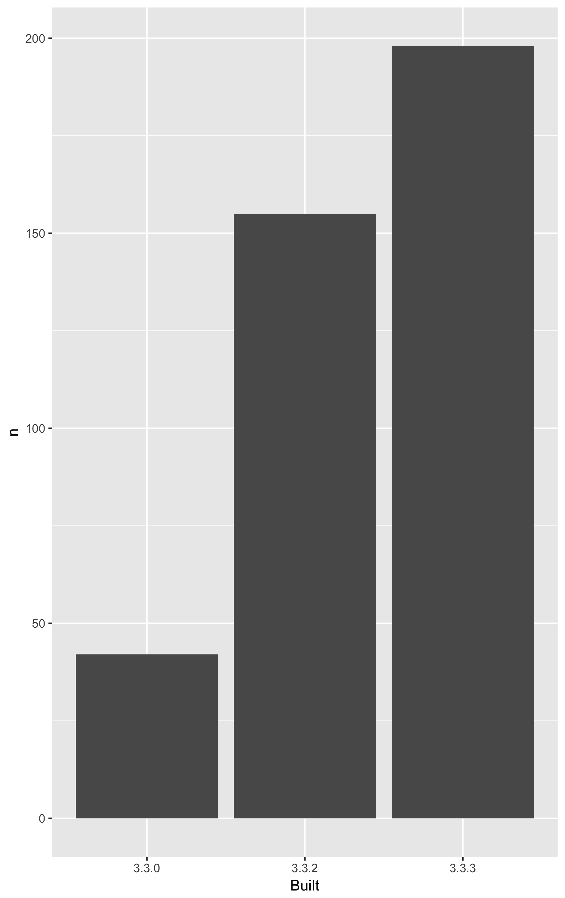

<!-- README.md is generated from README.Rmd. Please edit that file -->

```{r setup, include = FALSE}
knitr::opts_chunk$set(
  collapse = TRUE,
  comment = "#>"
)
library(tidyverse)
library(here)
```

# packages-report

## Workshop challenge checklist

*As you complete tasks, you can ~~cross them out~~ by surrounding with `~~`.*

* Have a look around the files here. Where are the R scripts? What are the directories `data` and `figs` for?
* Notice that this README is an `.Rmd` file. That means it could contain R code and will need to be rendered to create `README.md`.
* Open [R/01_write-installed-packages.R](R/01_write-installed-packages.R). Write the script as directed. Run it. Commit and push the current state.
* Open [R/02_wrangle-packages.R](R/02_wrangle-packages.R). Fill in the missing pieces of the script as directed. Run it. Commit and push the current state.
* Open [R/03_barchart-packages-built.R](R/03_barchart-packages-built.R). Fill in the missing pieces of the script as directed. Run it. Commit and push the current state.
* Fill in the blanks below in this README, using the results stored elsewhere.
* If you get this far, write an R script to run the whole analysis and, perhaps, another script that does a `make clean` style reset.

## Overview

The goal of packages-report is to explore packages we've got installed and practice safe paths.

```{r, include = FALSE}
apt <- read_csv("./data/add-on-packages.csv")
apt_freqtable <- read_csv("./data/add-on-packages-freqtable.csv")
```

I have `r apt %>% count() %>% as_vector()` add-on packages installed.

Here's how they break down in terms of which version of R they were built under, which is related to how recently they were updated on CRAN.

```{r, echo = FALSE}
## print the frequency table here
knitr::kable(apt_freqtable, format = "html")
```



### Flow of the analysis

[First](./R/01-write-isntalled-packages.R) we get all of our packages, [second](./R/02-wrangle-packages.R) we munge them into added on packages and break that down by version, and [third](./03-barchart-packages-built.R) we save the barchart.


