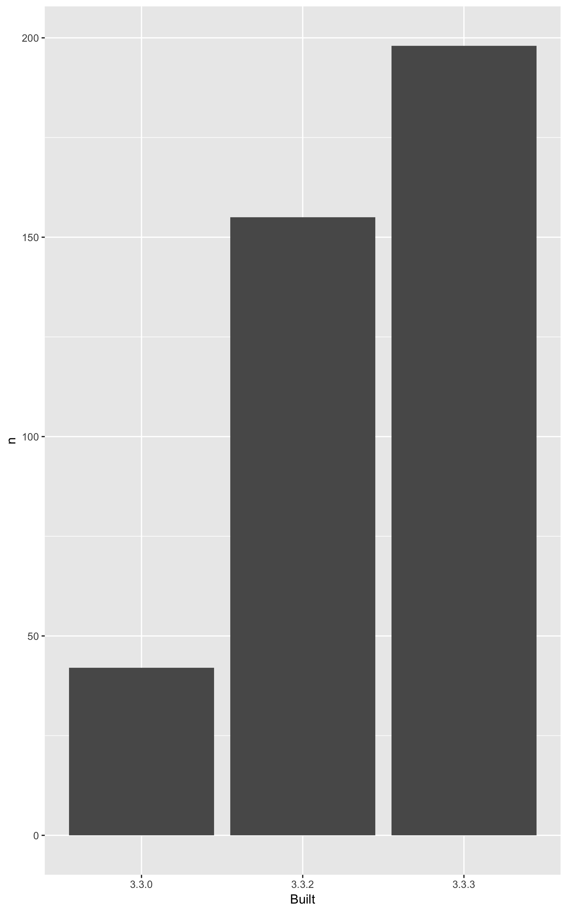

<!-- README.md is generated from README.Rmd. Please edit that file -->
packages-report
===============

Workshop challenge checklist
----------------------------

*As you complete tasks, you can ~~cross them out~~ by surrounding with `~~`.*

-   Have a look around the files here. Where are the R scripts? What are the directories `data` and `figs` for?
-   Notice that this README is an `.Rmd` file. That means it could contain R code and will need to be rendered to create `README.md`.
-   Open [R/01\_write-installed-packages.R](R/01_write-installed-packages.R). Write the script as directed. Run it. Commit and push the current state.
-   Open [R/02\_wrangle-packages.R](R/02_wrangle-packages.R). Fill in the missing pieces of the script as directed. Run it. Commit and push the current state.
-   Open [R/03\_barchart-packages-built.R](R/03_barchart-packages-built.R). Fill in the missing pieces of the script as directed. Run it. Commit and push the current state.
-   Fill in the blanks below in this README, using the results stored elsewhere.
-   If you get this far, write an R script to run the whole analysis and, perhaps, another script that does a `make clean` style reset.

Overview
--------

The goal of packages-report is to explore packages we've got installed and practice safe paths.

I have 395 add-on packages installed.

Here's how they break down in terms of which version of R they were built under, which is related to how recently they were updated on CRAN.

<table>
<thead>
<tr>
<th style="text-align:left;">
Built
</th>
<th style="text-align:right;">
n
</th>
<th style="text-align:right;">
prop
</th>
</tr>
</thead>
<tbody>
<tr>
<td style="text-align:left;">
3.3.0
</td>
<td style="text-align:right;">
42
</td>
<td style="text-align:right;">
0.1063291
</td>
</tr>
<tr>
<td style="text-align:left;">
3.3.2
</td>
<td style="text-align:right;">
155
</td>
<td style="text-align:right;">
0.3924051
</td>
</tr>
<tr>
<td style="text-align:left;">
3.3.3
</td>
<td style="text-align:right;">
198
</td>
<td style="text-align:right;">
0.5012658
</td>
</tr>
</tbody>
</table>

### Flow of the analysis

[First](./01-write-isntalled-packages.R) we get all of our packages, [second](./02-wrangle-packages.R) we munge them into added on packages and break that down by version, and [third](./03-barchart-packages-built.R) we save the barchart.
